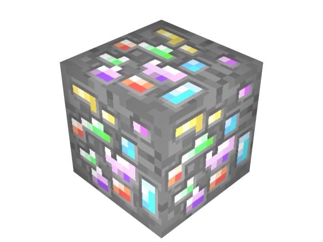

**QuantumCraft will implement worldgen features starting in 0.5 (the first playable version).**

##Quantonium Ore
*Quantonium Ore* is the source of *Crystallized Quantonium*. When you break a block of Quantonium Ore, it will drop few pieces of Raw Quantonium. When you smelt Raw Quantonium, you get Crystallized Quantonium.

