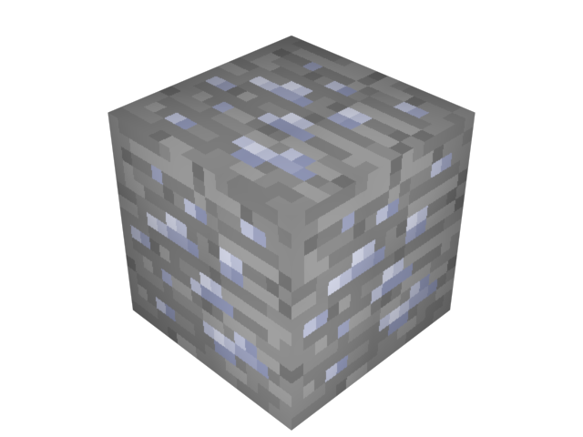

**QuantumCraft will implement worldgen features starting in 0.5 (the first playable version).**

##Plutonium Ore
*Plutonium* is the basic building material in QuantumCraft. When you break a block of Plutonium Ore, it will drop itself, and when you smelt it, you get a *Plutonium Ingot*.

