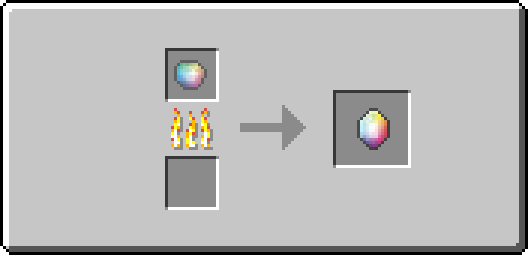

**QuantumCraft will implement worldgen features starting in 0.5 (the first playable version).**

##Raw Quantonium
*Raw Quantonium* is a material received upon breaking a block of Quantonium Ore. It is also used in production of Quantonium Crystals.

Furnace:
1 Raw Quantonium -> 2 Crystallized Quantonium
