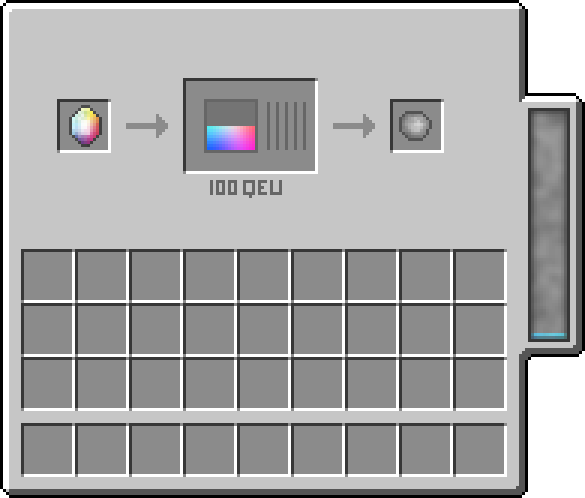

**QuantumCraft will implement worldgen features starting in 0.5 (the first playable version).**

##Raw Quantonium
*Crystallized Quantonium* is used for extraction of Quantum Energy. You can get it by smelting Raw Quantonium. When you put this material into a Quantum De-Energizer, It will be turned to a single Depleted Crystal and 100 Quantum ENergy Units (QEU)

Furnace:
1 Raw Quantonium -> 2 Crystallized Quantonium

Quantum De-Energizer:
1 Crystallized Quantonium -> 100 Quantum Energy Units (QEU) + 1 Depleted Crystal
