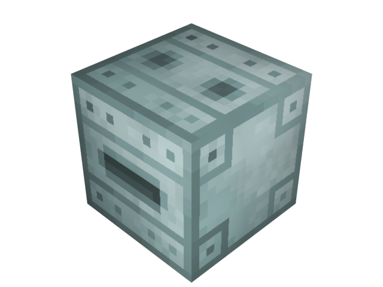

The _Quantum Deenergizer_ or _QDeenergizer_ or even _QDE_ for short, is a device from **Quantonium Industries** that has been in design for a few days. Simply place some _Crystallized Quantonium_ in the left hand slot and out comes a _Depleted Crystal_. In the process of doing so it generates 100 _Quantonium Energy_.

Quantum De-Energizer:
1 Crystallized Quantonium -> 100 Quantum Energy Units (QEU) + 1 Depleted Crystal

