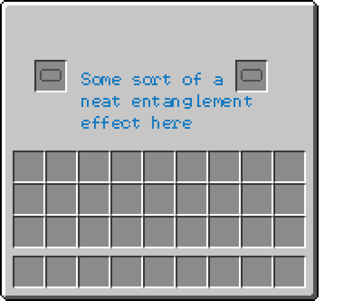
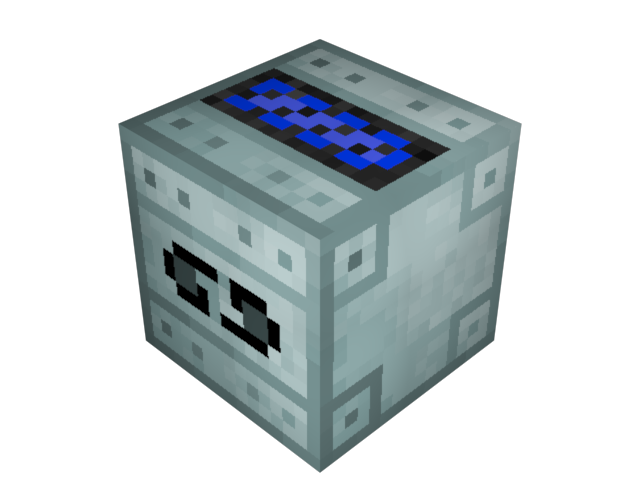

The _Quantum Dislocator_ (_QDislocator_, _QDS_) is another machine by **Quantonium Industries**. This complex machine uses the phenomenon of *Quantum Dislocation* for your advantage. It brings to you ender-anything. Simply place it down and put two location cards in it. When one of the referenced blocks is modified, the other is modified in the same way. this includes the TileEntities inside the blocks.

Quantum Dislocator:

